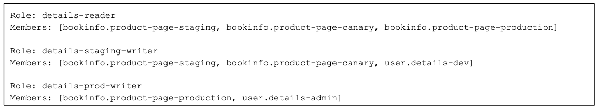
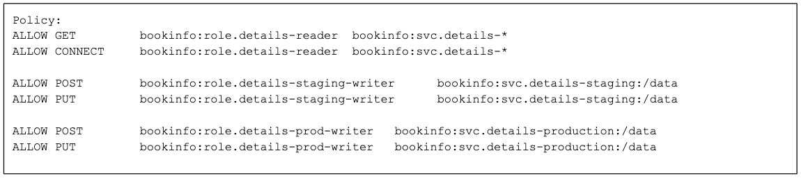
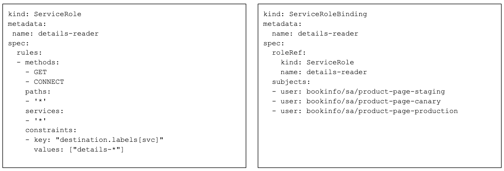
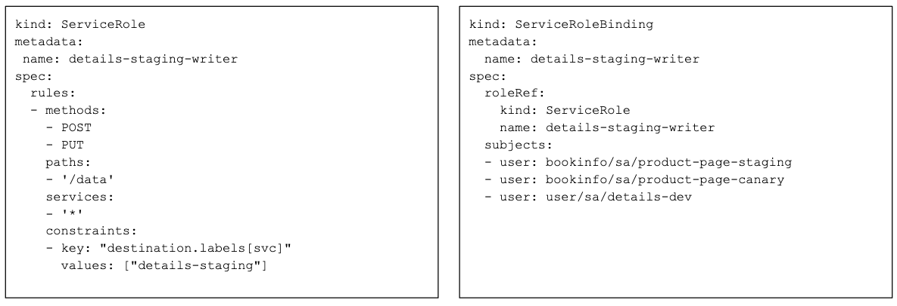
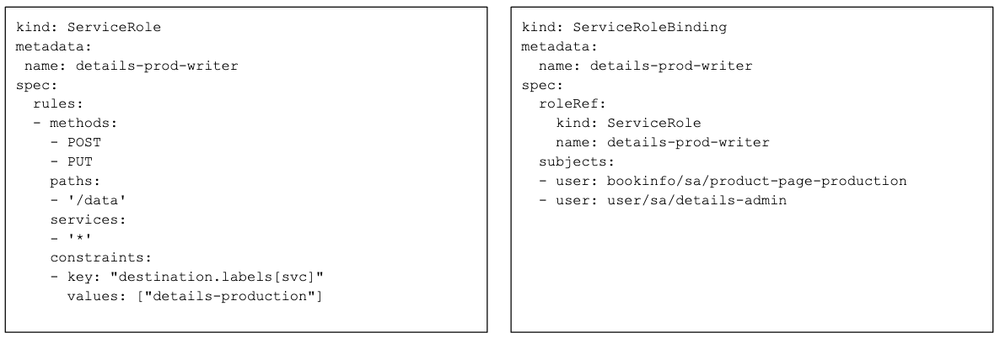
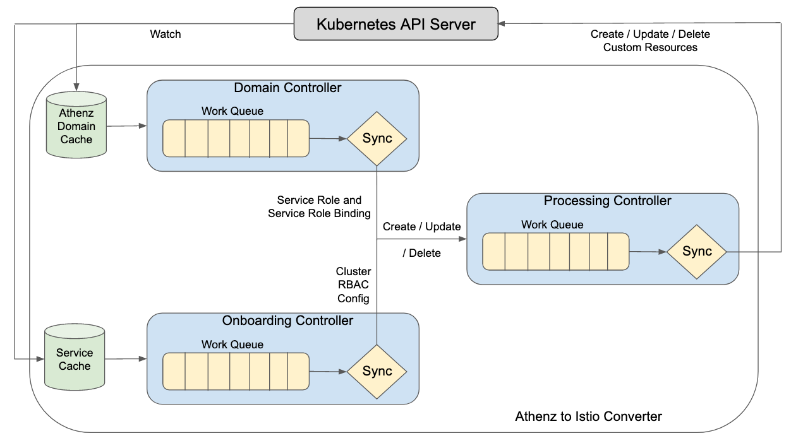

# K8s-athenz-istio-auth [](https://travis-ci.com/yahoo/k8s-athenz-istio-auth)
K8s-athenz-istio-auth is a controller which converts Athenz domains to Istio RBAC custom resources.

## Table of Contents

- [Background](#background)
- [Architecture](#Architecture)
- [Install](#install)
- [Configuration](#configuration)
- [References](#references)
- [Contribute](#contribute)
- [License](#license)

## Background
[Athenz](https://www.athenz.io/) is an IAM provider which allows users to define
role based access control (RBAC) for users and services. It also acts as a certificate
authority (CA) by provisioning instances with unique identities through X.509 certificates.

In order to adopt Athenz as an unified RBAC provider for managing access to Kubernetes
services, we needed a controller that can dynamically fetch Athenz role / policy mappings
and convert them to their corresponding Istio custom resources, so we built this
controller to allow users to define RBAC through Athenz and have it integrate with
the Istio world.

### Istio RBAC
Istio V1 RBAC contains three primary custom resources, Service Roles, Service Role
Bindings, and the Cluster RBAC Config. The descriptions of each of these is given
below.
- **Service Role** - Contains a list of permissions which are allowed for a target
service, such as what http paths and methods are allowed.
- **Service Role Binding** - Contains a list of users which are allowed the permissions
which are specified in the service role.
- **Cluster RBAC Config** - Specifies the list of services which are onboarded onto the
Istio RBAC feature.

More information on how RBAC works in Istio can be found on their official website
[here](https://istio.io/docs/concepts/security/#authorization).

## Architecture

### Athenz to Istio Mapping
Once the controller is up and running, a user may go into the Athenz UI and define roles
and policies for their services. The following walkthrough will show how to setup the 
[bookinfo](https://istio.io/docs/examples/bookinfo/) Istio example using the product
page and details applications.

The details application is a backend service the frontend product page will be calling
for both read and write operations. To recreate a similar production deployment workflow
the application owners currently utilize, we use three separate environments which include
staging, canary, and production. The user will setup up read and write permissions for
different environments. The Athenz roles will be used to define the members, which can be
either services or users, which are allowed access to the roles corresponding policies.
The Athenz policies will define the permissions the roles have on services, the currently
supported actions are HTTP methods and paths.

We will consider three separate Athenz roles, details-reader, details-staging-writer,
and details-prod-writer shown in the following picture.


Their corresponding Athenz policies are shown below.


The descriptions of each role and policy:
- **details-reader** - Allows staging, canary, and production product page to read
information from any environment of the details server.
- **details-staging-writer** - Allows dev users, staging, and canary product page
to POST and PUT to the staging details environment on the /data path.
- **details-prod-writer** - Allows production product page and admin users to POST
and PUT to the production details environment on the /data path.

The Service role and service role binding for the details-reader role and policy
is shown below.

- **details-reader service role** - Defines that the HTTP GET and CONNECT methods 
are allowed for any path for any details environment.
- **details-reader service role binding** - Defines the SPIFFE ID of three users
which are allowed access, the product page staging, canary, and production
environments.

The Service role and service role binding for the details-staging-writer role and
policy is shown below.

- **details-staging-writer service role** - Defines that the HTTP POST and PUT
methods are allowed for the staging details environment on the /data path.
- **details-staging-writer service role binding** - Defines the SPIFFE ID of
three users which are allowed access, a dev user, product page staging and
canary environments.

The Service role and service role binding for the details-prod-writer role and
policy is shown below.

- **details-prod-writer service role** - Defines that the HTTP POST and PUT
methods are allowed for the production details environment on the /data path.
- **details-prod-writer service role binding** - Defines the SPIFFE ID of two
users which are allowed access, an admin user and the product page production
environments.

#### Onboarding
The onboarding of a service is done through an annotation in the service object
shown below.
```
annotations:
  authz.istio.io/enabled: "true"
```
By turning this annotation to true, the controller will pick up the change and
onboard the service onto the Istio cluster rbac config which will turn on
authorization for the application. The onboarding controller assumes that the
ClusterRbacConfig is configured with ```Mode: v1alpha1.RbacConfig_ON_WITH_INCLUSION```
and the services that require authorization enabled are added individually as FQDNs.
The controller does not support any other mode at this point.

**Warning**: Please define the RBAC in Athenz before doing the onboarded or else
the service will start returning 403 forbidden.

### Controller Design
In order to automate the translation of Athenz RBAC definitions into Istio custom
resources, a controller was built. The architecture was based upon known Kubernetes
controllers such as the deployment or replica set controllers which have been tried
and tested for multiple years.

The main idea behind the controller is to sync the current state of the cluster
into the desired state, in this context Athenz domain data into Istio custom
resources. The controller uses the concept of a work queue to handle syncing,
which is responsible for ordering work items in the order they received an update.
Each sync function will pop an item off the queue and process any state change required.

The converter is divided into three separate controllers within a single process
as described below.

####  Domain Controller
The domain controller is responsible for syncing Athenz domain data into Istio custom
resources. The following steps are taken in order to sync.
1. An Athenz domain custom resource change triggers an add of a key onto the domain
work queue.
2. The sync converts the Athenz domain data into the service role and service role 
binding objects based on the role members and policies.
3. These Istio custom resources are offloaded for processing onto the Istio custom
resource work queue.

#### Processing Controller
The processing controller is responsible for syncing the Istio custom resources with
the Kubernetes API server. The following steps are taken to sync.
1. Any Istio custom resource such as the service role, service role binding, or
cluster rbac config will populate an item onto the Istio CR work queue.
2. The sync will process the custom resource create / update / delete action which
will be sent to the Kubernetes API server.

#### Onboarding Controller
The onboarding controller is responsible for syncing the onboarding state of each
application. The following steps are taken to sync.
1. Any update in a service object will trigger an addition onto the work queue if
an authorization annotation is set to true.
2. The sync will update the cluster rbac config list with the onboarded service
to enable authorization from an Istio perspective.
3. This custom resource is offloaded onto the Istio CR work queue.

To onboard a service to be dynamically synced through this controller, a service
annotation must be set to true. This onboarding controller contains a watch on all
service objects within the cluster and will start acting upon any changes from
Athenz once this is set.

#### Putting it all together
The main controller is a collection of these three working together in order to
sync each separate custom resource. The architecture of the controller is shown
below.



Once the service role, service role bindings, and cluster rbac config are created
on the cluster, the Istio control plane will pick up the changes and distribute
the Envoy configuration to the proxies bundled along with their corresponding
applications which will start enforcing the newest authorization policies right away.


### Upcoming features
We currently have support to map the Athenz IAM to the Istio v1 RBAC which includes
the service role and service role binding custom resource objects as of the Istio 1.3
version. In the upcoming versions, we plan to support Istio v2 RBAC which will use
the authorization policy custom resource.

The code was also designed and written in such a way which allows any IAM provider
to integrate with this controller to map to Istio RBAC. Currently, we support Athenz
but Google Cloud, AWS, and Microsoft Azure IAM support can be integrated in the
future as well.

## Install

### Prerequisite
There are a variety of prerequisites required in order to run this controller, they
are specified below.
- **Kubernetes cluster** - A running Kubernetes cluster is required with access to
the control plane. More information on how to setup a cluster can be found in the
official documentation
[here](https://kubernetes.io/docs/setup/). This controller was developed and tested
with the 1.13 release.
- **Istio** - Istio must be fully deployed in the cluster with the ServiceRole and
ServiceRoleBinding custom resources. More information on how to setup Istio can be
found [here](https://istio.io/docs/setup/kubernetes/). This controller was developed
and tested with the Istio 1.3 release.
- **Athenz** - Athenz must be fully deployed in order for users to be able to define
roles and policies in their domain. More information and setup steps can be found
[here](http://www.athenz.io/). The authorization management service (ZMS) and its
apis are primarily used for this controller.
- **Athenz syncer** - The Athenz syncer must be fully deployed and syncing Athenz domain
data into custom resources for this controller to watch. The repo can be found
[here](https://github.com/yahoo/k8s-athenz-syncer).

### Setup
Configuration files which must be applied to run k8s-athenz-istio-auth can be found
in the k8s directory.

#### ServiceAccount
Run the following command to apply the service account:
```
kubectl apply -f k8s/serviceaccount.yaml
```
or
```
kubectl create serviceaccount k8s-athenz-istio-auth
```

#### ClusterRole and ClusterRoleBinding
This controller requires RBAC to read all namespaces in the cluster and to take
various actions on the ServiceRole and ServiceRoleBindings objects, so make sure
you run it in an admin namespace. Run the following commands:
```
kubectl apply -f k8s/clusterrole.yaml
kubectl apply -f k8s/clusterrolebinding.yaml
```

#### Deployment
The deployment for the controller contains one main container for the controller
itself. Build a docker image using the Dockerfile and publish to a docker registry.
Make sure to replace the docker image inside of this spec to the one which is published
in your organization. Run the following command in order to deploy:
```
kubectl apply -f k8s/deployment.yaml
```

## Configuration
K8s-athenz-istio-auth has a variety of parameters that can be configured, they are
given below.

**Parameters**
```
dns-suffix (default: svc.cluster.local): dns suffix used for service role target services
kubeconfig (default: ""): (optional) absolute path to the kubeconfig file
ad-resync-interval (default: 1h): athenz domain resync interval
crc-resync-interval (default: 1h): cluster rbac config resync interval
enable-origin-jwt-subject (default: true): enable adding origin jwt subject to service role binding
log-file (default: /var/log/k8s-athenz-istio-auth/k8s-athenz-istio-auth.log): log file location
log-level (default: info): logging level
```

## References
This project was presented at the 2019 Service Mesh Day, the slides can be found
[here](https://docs.google.com/presentation/d/1shgwkhGlIVa3uAMbgPzef3nnx2N_HA3cO3pcE0MQeQg/edit?usp=sharing).

The video of the presentation can be found here:

[](http://www.youtube.com/watch?v=HcGRou7X0UQ "Service Mesh Day Talk")

## Contribute

Please refer to the [contributing](Contributing.md) file for information about how to get involved. We welcome issues, questions, and pull requests.

## Maintainers/Contacts
Core Team : omega-core@verizonmedia.com

## License
Copyright 2019 Verizon Media Inc. Licensed under the terms of the 3-Clause BSD License.
