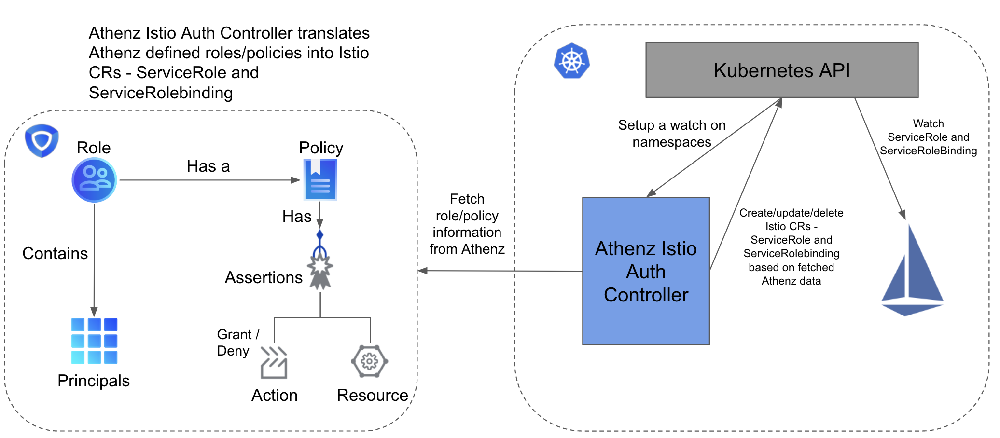

> A controller that polls Athenz to update the ServiceRole and ServiceRoleBinding Istio custom resources.

# K8s-athenz-istio-auth [](https://travis-ci.com/yahoo/k8s-athenz-istio-auth)
K8s-athenz-istio-auth is a controller that polls Athenz to update the ServiceRole and ServiceRoleBinding Istio custom 
resources; it watches all namespaces and looks up the corresponding Athenz domains associated with them. 

### Architecture


## Table of Contents

- [Background](#background)
- [Install](#install)
- [Configuration](#configuration)
- [Usage](#usage)
- [Contribute](#contribute)
- [License](#license)

## Background
We needed a controller that can dynamically fetch Athenz role / policy mappings and convert them to their corresponding 
Istio custom resources, so we built this controller to allow users to define RBAC through Athenz and have it integrate 
with the Istio world.

The role name in Athenz specifies the target service in the ServiceRole object and its corresponding HTTP methods are 
listed as policies. The services that can access this target service are members of the role and will be listed in the 
ServiceRoleBinding.

**Example ServiceRole**
```
apiVersion: rbac.istio.io/v1alpha1
kind: ServiceRole
metadata:
  name: backend.domain.details
  namespace: backend-domain
spec:
  rules:
  - methods:
    - GET
    services:
    - details.backend-domain.svc.cluster.local
```

**Example ServiceRoleBinding**
```
apiVersion: rbac.istio.io/v1alpha1
kind: ServiceRoleBinding
metadata:
  name: backend-domain.details
  namespace: backend-domain
spec:
  roleRef:
    kind: ServiceRole
    name: backend-domain.details
  subjects:
  - user: frontend.domain/sa/productpage
```

## Install

### Prerequisite
There are a variety of prerequisites required in order to run this controller, they are specified below.
- **Kubernetes cluster** - A running Kubernetes cluster is required with access to the control plane. More
information on how to setup a cluster can be found in the official documentation
[here](https://kubernetes.io/docs/setup/). This controller was developed and tested with the 1.11 release.
- **Istio** - Istio must be fully deployed in the cluster with the ServiceRole and ServiceRoleBinding custom
resources. More information on how to setup Istio can be found [here](https://istio.io/docs/setup/kubernetes/). This
controller was developed and tested with the Istio 1.0.3 release.
- **Athenz** - Athenz must be fully deployed in order for users to be able to define roles and policies in
their domain. More information and setup steps can be found [here](http://www.athenz.io/). The authorization
management service (ZMS) and its apis are primarily used for this controller.

### Setup
Configuration files which must be applied to run k8s-athenz-istio-auth can be found in the k8s directory.

#### ServiceAccount
Run the following command to apply the service account:
```
kubectl apply -f k8s/serviceaccount.yaml
```
or
```
kubectl create serviceaccount k8s-athenz-istio-auth
```

#### ClusterRole and ClusterRoleBinding
This controller requires RBAC to read all namespaces in the cluster and to take various actions on the ServiceRole and
ServiceRoleBindings objects, so make sure you run it in an admin namespace. Run the following commands:
```
kubectl apply -f k8s/clusterrole.yaml
kubectl apply -f k8s/clusterrolebinding.yaml
```

#### Deployment
The deployment for the controller contains one main container for the controller itself. Build
a docker image using the Dockerfile and publish to a docker registry. Make sure to replace the docker image inside of
this spec to the one which is published in your organization. Run the following command in order to deploy:
```
kubectl apply -f k8s/deployment.yaml
```

## Configuration
K8s-athenz-istio-auth has a variety of parameters that can be configured, they are given below.

**Parameters**
```
dns-suffix (default: svc.cluster.local): dns suffix used for service role target services
kubeconfig (default: empty): (optional) absolute path to the kubeconfig file
ad-resync-interval (default: 1h): athenz domain resync interval
crc-resync-interval (default: 1h): cluster rbac config resync interval
log-file (default: /var/log/k8s-athenz-istio-auth/k8s-athenz-istio-auth.log): log file location
log-level (default: info): logging level
```
## Usage
Once the controller is up and running, a user may go into the Athenz UI and define roles and policies for their
services. For example, if the user has frontend and backend services running, and want to authorize only the frontend
to make http GET requests to the backend, they may run through the following steps.
1. Create a role in the backends Athenz domain prefixed with `service.role`. For example: 
`service.role.backend.domain.backend`
2. Create a policy in the backends Athenz domain with the same name as the role defined above.
3. Define an assertion which allows the action GET.
4. Add the frontend service as a member of the role, example: `frontend.domain.frontend`, in order to authorize it to 
make GET requests.

## Contribute

Please refer to the [contributing](Contributing.md) file for information about how to get involved. We welcome issues, questions, and pull requests.

## Maintainers/Contacts
Core Team : omega-core@verizonmedia.com

## License
Copyright 2019 Verizon Media Inc. Licensed under the terms of the 3-Clause BSD License.
